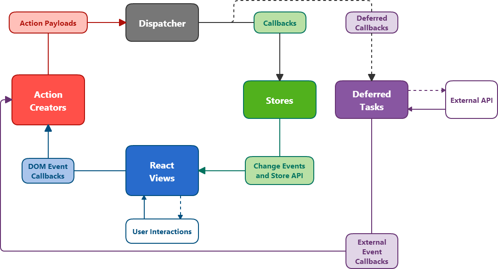

# Hippodrome structure and API

First, read
[Facebook's explanation of Flux](https://github.com/facebook/flux/blob/master/README.md).
Hippodrome builds off those ideas, so understanding them will make much of what
follows clearer.

Good?  Good. Now here's Hippdrome:



Hippodrome's structure is very similar to stock Flux, with the addition of
Deferred Tasks, which we'll cover in more detail later.  Two things to note:
First, the dashed lines represent asynchronous operations.  Second, the boxes
with white backgrounds aren't strictly part of the Hippodrome+React system, but
need to be there in order to complete the picture of how data moves around.

## Actions

A Hippodrome Action is a function that builds a payload out of some arguments,
then sends that payload to the Dispatcher for consumption by Stores and Tasks.
Declare them like this:

```coffeescript
ProfileEditor.Actions.updateName = new Hippodrome.Action(
  'update Name',
  (newName) -> {name: newName}
)
```

The first argument is a name for the Action, which will show up in some error
messages and can be generally useful for figuring out what you're looking at
while debugging.  The second argument is a function that builds a payload with
the Action's data.  These functions should be as simple and pure as possible.
Avoid using the key `action` in your Action payloads - Hippodrome uses that
to identify which action the payload is from.

```coffeescript
# Sends the following object to the Dispatcher
#
# { action: 'Action_ID_1_update Name'
#   name: 'Alice'
# }

ProfileEditor.Actions.updateName('Alice')
```
